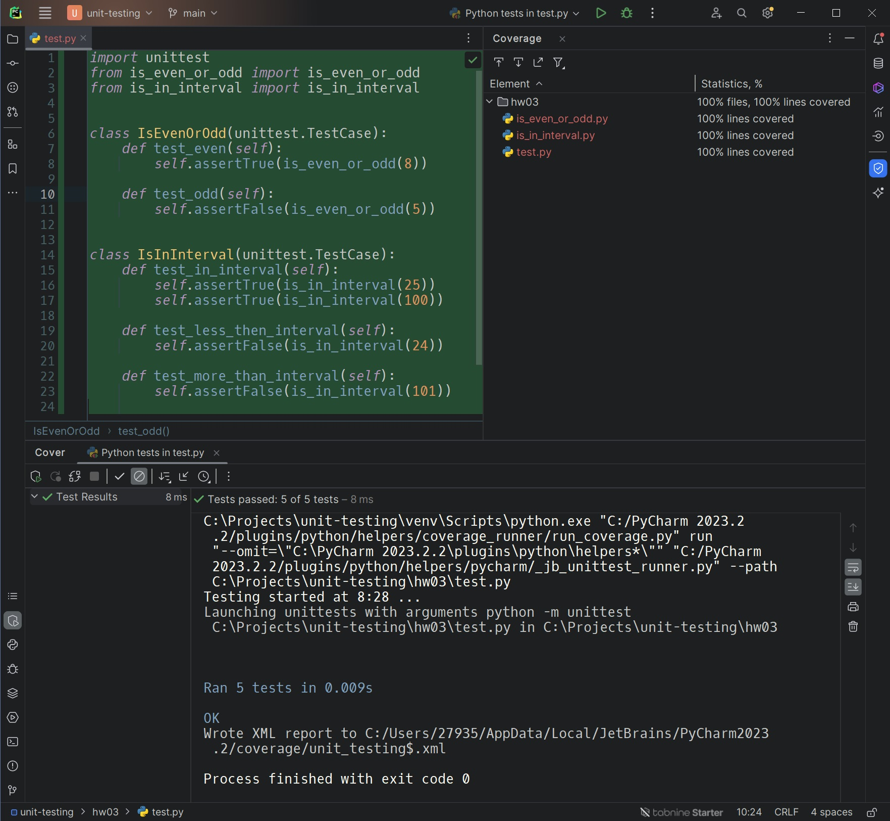

### Задание 1.1

В классе [**Calculator**](hw01/calculator.py) создайте метод **calculateDiscount**, который принимает сумму покупки и
процент скидки и возвращает
сумму с учетом скидки. Ваша задача - проверить этот метод ~~с использованием библиотеки **AssertJ**~~. Если метод
**calculateDiscount** получает недопустимые аргументы, он должен выбрасывать исключение **ArithmeticException**. Не
забудьте
написать [тесты](hw01/test.py) для проверки этого поведения.

### Задание 1.2 * (необязательное)

Мы хотим улучшить функциональность нашего интернет-магазина. Ваша задача - добавить два
новых метода в класс [**Shop**](hw01/shop.py): Метод **sortProductsByPrice**(), который сортирует список продуктов по
стоимости. Метод
**getMostExpensiveProduct**(), который возвращает самый дорогой продукт. Напишите [тесты](hw01/test.py), чтобы
проверить, что магазин хранит
верный список продуктов (правильное количество продуктов, верное содержимое корзины). Напишите [тесты](hw01/test.py) для
проверки
корректности работы метода **getMostExpensiveProduct**. Напишите [тесты](hw01/test.py) для проверки корректности работы
метода
**sortProductsByPrice** (проверьте правильность сортировки). Используйте [**Product**](hw01/product.py) для создания
экземпляров продуктов и
класс [**Shop**](hw01/shop.py) для написания методов сортировки и тестов.
___

### Задание 2.1

Проект [**Vehicle**](hw02/vehicle.py). Написать следующие [тесты](hw02/test.py) с использованием JUnit5:

- Проверить, что экземпляр объекта Car также является экземпляром транспортного средства (используя оператор
  instanceof).

- Проверить, что объект Car создается с 4-мя колесами.

- Проверить, что объект Motorcycle создается с 2-мя колесами.

- Проверить, что объект Car развивает скорость 60 в режиме тестового вождения (используя метод testDrive()).

- Проверить, что объект Motorcycle развивает скорость 75 в режиме тестового вождения (используя метод testDrive()).

- Проверить, что в режиме парковки (сначала testDrive, потом park, т.е. эмуляция движения транспорта) машина
  останавливается (speed = 0).

- Проверить, что в режиме парковки (сначала testDrive, потом park, т.е. эмуляция движения транспорта) мотоцикл
  останавливается (speed = 0).

В этом проекте, вы будете работать с проектом ""Vehicle"", который представляет собой иерархию классов, включающую
абстрактный базовый класс ""Vehicle"" и два его подкласса ""Car"" и ""Motorcycle"".

Базовый класс ""Vehicle"" содержит абстрактные методы ""testDrive()"" и ""park()"", а также поля ""company"", ""
model"", ""yearRelease"", ""numWheels"" и ""speed"".

Класс ""Car"" расширяет ""Vehicle"" и реализует его абстрактные методы. При создании объекта ""Car"", число колес
устанавливается в 4, а скорость в 0. В методе ""testDrive()"" скорость устанавливается на 60, а в методе ""park()"" -
обратно в 0.

Класс ""Motorcycle"" также расширяет ""Vehicle"" и реализует его абстрактные методы. При создании объекта ""
Motorcycle"", число колес устанавливается в 2, а скорость в 0. В методе ""testDrive()"" скорость устанавливается на 75,
а в методе ""park()"" - обратно в 0.
___

### Задание 3.1

Напишите [тесты](hw03/test.py), покрывающие на 100% метод [is_even_or_odd](hw03/is_even_or_odd.py), который проверяет,
является ли переданное число четным или
нечетным.

### Задание 3.2

Разработайте и протестируйте метод [is_in_interval](hw03/is_in_interval.py), который проверяет, попадает ли переданное
число в интервал (25;100).

___

### Задание 4.1

#### Ответьте на вопросы:

1) Почему использование тестовых заглушек может быть полезным при написании модульных тестов?
   > Заглушки используются для изоляции тестируемого модуля от других зависимостей. Для ускорения выполнения тестов,
   > заглушкой можно заменить медленные и сложные части кода, которые невозможно протестировать напрямую.

2) Какой тип тестовой заглушки следует использовать, если вам нужно проверить, что метод был вызван с определенными
   аргументами?
   > С помощью Mock-объекта можно проверить переданные аргументы и сохранить их.
3) Какой тип тестовой заглушки следует использовать, если вам просто нужно вернуть определенное значение или исключение
   в ответ на вызов метода?
   > Stab — объекты возвращают заранее определенные значения на определенные входные данные.

4) Какой тип тестовой заглушки вы бы использовали для имитации взаимодействия с внешним API или базой данных?
   > Fake — реализует несуществующий вариант производственной версии, для возврата зафиксированного объекта из файловой
   системы.

### Задание 4.2

У вас есть класс [book_service](hw04/book_service.py), который использует интерфейс [book_repository](hw04/book_repository.py) для получения
информации о книгах из базы данных. Ваша задача написать [unit-тесты](hw04/test.py) для [book_service](hw04/book_service.py), 
используя Mockito для создания
мок-объекта [book_repository](hw04/book_repository.py).